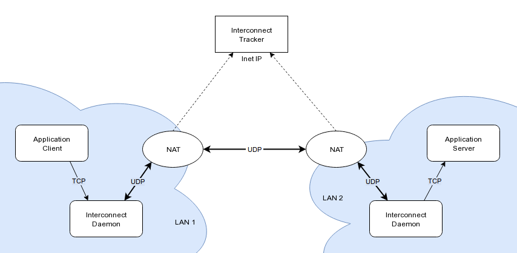

# Breedhub Interconnect

Ever wondered how your bittorrent software is able to establish
connection to your peer when both of you are behind NAT? This is
[UDP hole punching](https://en.wikipedia.org/wiki/UDP_hole_punching).

Now, let's say you have a MySQL server in one location and a number of
clients in other locations. And none of them has real IP address
including the server. Why not use this technique to let the clients
connect to the server?



Breedhub Interconnect is a network of TCP proxies that connect to each
other using UDP and UDP hole punching. All you need is just one host
with real IP - this would be the tracker which will help proxies (we
call them daemons) to find each other. All the clients don't need an IP
and will work through NAT if their firewall allows that (default Linux
does for example).

# Installation

* Tracker

  https://github.com/breedhub/bhit-node
  
  Or you can skip it entirely and just use default public Breedhub tracker
  
* Daemon

  https://github.com/breedhub/bhid-node
  
  This is what you need

# Usage

The same software (bhid) is used on all of your daemons. But there are
two types of daemons: regular ones which serve as a proxy and one master
daemon which might or might not serve connections but it has authority
over your network.

Some commands will work on any daemon other will only work on master
daemon (like daemon or connection creation commands).

Daemons serve *connections*. They are links between a server and a number
of clients. Each connection is identified by *path*. Organize your paths
as you like, for instance you could create path /toronto/mysql and
assign MySQL server in Toronto to it, /dublin/ssh for ssh server in
Dublin.

## First steps

When in doubt run **bhidctl help &lt;command&gt;** to get help on &lt;command&gt;

### init - Initialize the account

```bhidctl init <email> [-t <tracker>]```

Initialize your account on the tracker. You will receive a confirmation
email.

### confirm - Confirm email

```bhidctl confirm <token> [-t <tracker>]```

There will be confirmation token in the email. Choose one host that
will be your master daemon and run **confirm** command there. Master
token will be saved on this host.

If you ever want to move the master to other daemon just redeem its token
using **redeem** command (see below).

### register - Register new daemon

```bhidctl register [<daemon-name>] [-r] [-a] [-q] [-t <tracker>]```

Create new daemon. If name and -r flag are set then random digits to
the name provided will be appended. Without -r the exact name will be
used. If no name is given it will be random.
 
This command will print auth token of the daemon - you will need to use
it in **auth** command on target host to authorize the host as the daemon.
If -q is set then only daemon token will be printed with no additional
text (useful for scripting).

If -a is set then **auth** command will be ran on this very host
automatically. So you will *create* a daemon and *authorize* this host
as this new daemon with a single command.

Requires master token.

### unregister - Delete a daemon

```bhidctl unregister <daemon-name> [-t <tracker>]```

Delete daemon record from tracker. It will be removed from all the
connections.

Requires master token.

### auth - Set and save token for the daemon

```bhidctl auth <token> [-l] [-t <tracker>]```

Authorize this host as the daemon of the token provided. With -l flag
**load -f** command will be executed (see below).

### daemons - Print your daemons list

```bhidctl daemons [<path>] [-n] [-t <tracker>]```

Prints the list of all your daemons or just daemons attached to
&lt;path&gt;. Use -n for no-header version.
            
## Managing connections

### create - Create new connection

```bhidctl create <path> <connect-addr> [<listen-addr>] [-s|-c] [-e] [-f] [-t <tracker>]```

Create a new connection. If -s is set then this (master) daemon is
configured as server of this connection, or as client when -c is set.
Don't use neither -s nor -c if this master will not be part of the
connection.

If -e is set then connection is encrypted. If -f is set then connection
is fixed (clients list is saved and unknown clients will not be accepted
by server daemon until next **load** command run on the server, daemons
will also not be allowed to change their RSA keys).

&lt;connect-addr&gt; and &lt;listen-addr&gt; are written in the form of
host:port or just /path/to/unix/socket. Listen host and port can
contain &lowast; symbol for any host or random port respectively.
Default listen address is &lowast;:&lowast;.

Note: listen address is just a recommendation for the client of the
connection, they will still be able to set any listen address they want
when actually attaching to the connection.

Requires master token.

### delete - Delete a connection

```bhidctl delete <path> [-t <tracker>]```

Delete path recursively with all the connections.

Requires master token.

### tree - Print user tree

```bhidctl tree [<path>] [-d <daemon-name>] [-t <tracker>]```

Print tree of connections of this account.

## Local daemon configuration

Any daemon could be attached to a connection as server or client using
these local configuration commands. You will need connection token.

Use this method to allow other users of the tracker to connect to your
daemon. Give them token of the connection and they will be able to
attach to it.

### import - Import a token

```bhidctl import <token> [-t <tracker>]```

Import the token and make its connections ready to be attached to.

**connections** command can be used to list imported but not yet
attached to connections.

Imported connections will be reset on the next daemon restart - attach
to them before restarting the daemon.

### attach - Make this daemon a server or a client of a connection

```bhidctl attach <path> [<addr-override>] [-t <tracker>]```

Attach this daemon to the given path imported previously. Address is in
the form of host:port or /path/to/unix/socket. If host or port value
is omitted then default will be used (set with **create** command).

Client connection listen address override host or port can contain &lowast;
symbol, which means all interfaces and random port respectively. Server
connection address override cannot contain &lowast;.

### detach - Detach this daemon from given connection

```bhidctl detach <path> [-t <tracker>]```

Detach this daemon from a connection without deleting the connection on
the tracker.

### connections - Print this daemon connections

```bhidctl connections [<path>] [-n] [-t <tracker>]```

Print this daemon connections. Use -n for no-header version.

## Remote daemon configuration

Daemons could also be configured remotely. This is only possible when
running these commands on master daemon.

Note: Daemon *could* be configured remotely, but the new connections
will not be activated until you login to that daemon and run **load**
command there.

New configuration is also applied when running **auth** command on the
daemon.

### rattach - Make any your daemon a server or a client of your connection

```bhidctl rattach <path> <daemon-name> [<addr-override>] [-s] [-t <tracker>]```

**rattach** is similar to **attach** command. The only difference is
that in the case of **attach** type of the daemon (server or client) is
determined by the token you use. With **rattach** however there is no
token and daemon is configured as client by default or when -s flag is
given as a server.

Requires master token.

### rdetach - Detach your daemon from given connection

```bhidctl rdetach <path> <daemon-name> [-t <tracker>]```

Detach specified daemon from a connection without deleting the
connection on the tracker.

Requires master token.

### load - Load current connection configuration from tracker

```bhidctl load [-f] [-t <tracker>]```

Retrieve and save locally connection configuration from the tracker.
If -f is set then no confirmation is asked.

## Regaining access

### redeem - Redeem account, daemon or connection token

```bhidctl redeem <email> [-t <tracker>]```

```bhidctl redeem <daemon-name> [-t <tracker>]```

```bhidctl redeem <path> [-s|-c] [-t <tracker>]```

Redeem account, daemon or connection token. If -c is set the client
token will be regenerated (default), or server token if -s is set.

Redeeming daemon or connection requires master token.
